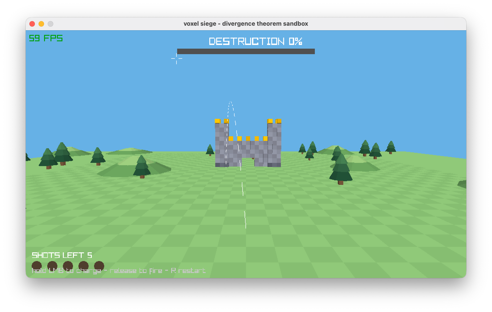

# voxel-siege

An Angry-Birds-style artillery sandbox in [Jolt](https://github.com/jolt-lang/jolt)
(Clojure on Chez Scheme), rendered with raylib over the C ABI.

You command a cannon at the near end of a range. A voxel castle stands at the
far end. Hold the left mouse button to charge, release to fire. Five shots per
round; topple 70% of the castle to win.

The interesting part: destruction scoring, body mass, and center-of-mass all
come from the divergence theorem — a body's volume is exactly its cell count
however it tumbles, and centroids come straight off the surface mesh.

<p align="center">
  
</p>

## Run

```
jolt -M:run          # needs a display (or see headless below)
```

- Aim: move the mouse (yaw/pitch of the barrel)
- Fire: hold LMB to charge, release to fire (longer hold = faster shot)
- R: restart the round

## Test

```
jolt -M:test         # 34 tests, 171 assertions
```

All game logic (`voxel.mesh`, `voxel.world`) is pure with no raylib or Box3D
calls, making it fully testable in a terminal.

## Physics (Box3D)

Rigid bodies run on [Box3D](https://github.com/erincatto/box3d) (Erin Catto's
3D successor to Box2D) over a small C shim: Box3D's public API passes vectors
by value in FP registers, which `jolt.ffi` cannot express, so
`native/voxel_b3.c` marshals everything and exposes a pointer/scalar-only ABI
(body and world ids cross as integers). Build once with:

```
scripts/build-native.sh   # vendors box3d, builds libbox3d + the shim
```

- The cannonball is a real sphere body; gravity and rolling come from Box3D.
- The field is dressed Tunic-style: a soft two-tone grass checker, low
  flat-topped hills, and stepped pines (`voxel.terrain` — deterministic per
  seed, and placement keeps the firing corridor clear).
- The castle is rigid bodies from frame one: each structural part (tower,
  curtain wall, tower) is one compound Box3D body — one 0.98-wide box hull
  per cell — spawned asleep, so the standing castle costs nothing until
  disturbed but topples for real once its support is blown out.
- Blasts destroy cells and split bodies along the rubble: survivors are
  re-grouped by 6-connectivity into fresh bodies that inherit the parent's
  pose and wake. There is no static voxel grid, no freeze-back, and no
  detach-on-blast anywhere in the loop.
- Blocks that fall never disappear: a body that hits hard enough (a speed
  drop past `SHATTER-SPEED`) breaks into per-cell rubble bodies that stay
  on the scene, spraying with the impact velocity and then settling to
  sleep like any other body. Each cell counts as destroyed exactly once —
  when a blast carves it or when its body first breaks — so re-blasting
  rubble carves it but cannot double-count it.
- `voxel.physics` steps the world each frame and reports plain-data facts
  (position, quaternion, velocity, speed, asleep) back into
  `voxel.world/apply-physics`, which alone decides splits, shatters,
  settling, and scoring — the pure layer stays testable without native
  libraries.
- Stone feel comes from physics tuning: cell density 2.0, friction 0.8,
  restitution 0.05, heavy linear/angular damping, a raised sleep threshold,
  and a modest explosion impulse (the cannonball's momentum does the real
  demolition). A body below settle-speed for half a second is declared
  settled by the pure world and force-slept through `b3Body_SetAwake`,
  which settles its whole contact island so rubble stops moving for good.

`jolt -M:b3probe` smoke-tests the whole FFI chain (gravity, contact, sleep,
explosion impulse, ballistics) against analytic expectations.


## Headless smoke

```
RAYLIB_APP_AUTO_QUIT_MS=4000 RAYLIB_APP_SHOT=vs_title.png jolt -M:run
VOXEL_APP_AUTOFIRE=40 RAYLIB_APP_AUTO_QUIT_MS=10000 \
  RAYLIB_APP_SHOT=vs_impact.png jolt -M:run
```

`RAYLIB_APP_SHOT` must be a *bare filename* (raylib prepends the cwd).
`VOXEL_APP_AUTOFIRE=<frame>` skips the title screen and fires one scripted
shot (pitch 0.40, power 0.9); on exit it prints a summary line:

```
[voxel] smoke summary: {:frame 262, :destruction 0.089..., :events [:blast :shatter :shatter], :phase :playing}
```

## Voxel computation

For a closed triangulated surface, the volume is

```
V = (1/6) Σ  (Δ₁ × Δ₂)ₓ · (x₀ + x₁ + x₂)
```

Each voxel occupies `[i,i+1]×[j,j+1]×[k,k+1]` (volume exactly 1), so the test
is the mesh volume of any voxel set equals its voxel count, and
the centroid equals the mean cell center. That identity is asserted across
boxes, walls, hollow shells, L-shapes, blobs, and random clusters.


- **Destruction %** = `1 − live-cells/initial-cells`. Bodies are unit cubes,
  so a body's cell count *is* its volume however it is rotated.
- **Body mass** = cell count × density (2.0) — the mesh-volume identity makes
  the divergence-theorem volume and the cell count the same number.
- **Body center of mass** = Box3D's computed mass data; the world anchors
  each body at its cell centroid.

